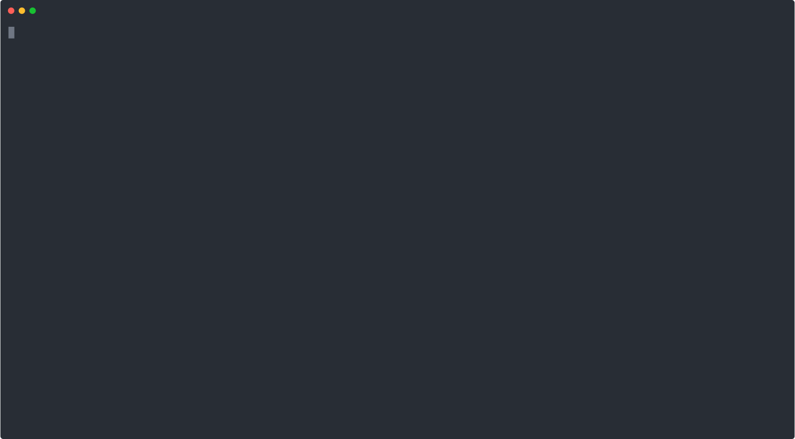

# Closing the Loop



## Input

The script needs the username and password of the target device, along with the IP address and port number gRPC is listening to. To secure the connection you also need to provide a TLS certificate ([instructions to get it](https://github.com/nleiva/xrgrpc/blob/master/README.md#certificate-file)).

```go
router, err := xr.BuildRouter(
  xr.WithUsername("cisco"),
  xr.WithPassword("cisco"),
  xr.WithHost("[2001:420:2cff:1204::5502:2]:57344"),
  xr.WithCert("../../input/certificate/ems5502-2.pem"),
  xr.WithTimeout(45),
)
```

## Generate Go structs

As described in the [bgp](../bgp/README.md), [interface](../interface/README.md) and [telemetry](../telemetry/README.md) examples.

## Running it

```console
$ go run main.go

1)
Telemetry config applied on 2001:420:2cff:1204::5502:2 (Request ID: 1451)
Press 'Enter' to continue...

2)
Interface config applied on 2001:420:2cff:1204::5502:2 (Request ID: 1452)
Press 'Enter' to continue...

3)
BGP config applied on 2001:420:2cff:1204::5502:2 (Request ID: 1453)
Press 'Enter' to continue...

4)
Receiving Telemetry from 2001:420:2cff:1204::5502:2 ->

Neighbor: 2001:db8::11, Time: 10:26:12, State: ESTABLISHED


                        Session ✅
```

## JSON payload generated

As described in the [bgp](../bgp/README.md), [interface](../interface/README.md) and [telemetry](../telemetry/README.md) examples.

## Final result on the router (target)

```console
RP/0/RP0/CPU0:mrstn-5502-2.cisco.com#sh run router bgp
router bgp 64512
 bgp router-id 203.0.113.22
 address-family ipv6 unicast
 !
 neighbor 2001:db8::11
  remote-as 64512
  description iBGP session
  address-family ipv6 unicast
  !
 !
!
```